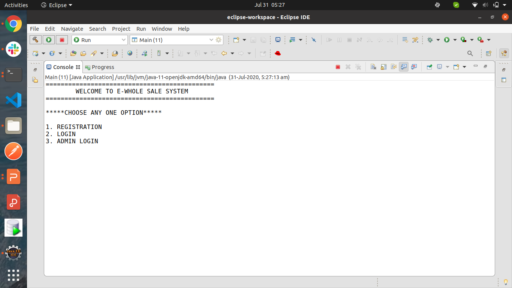
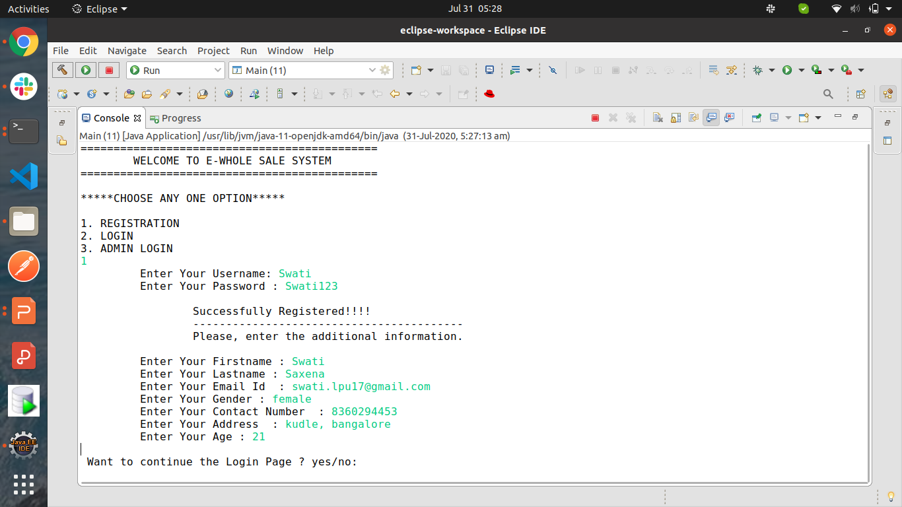
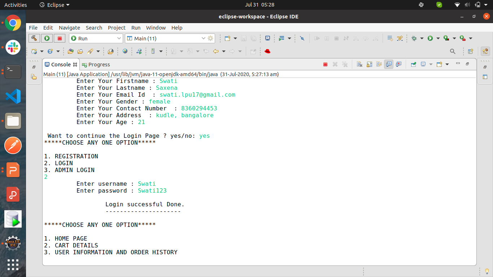
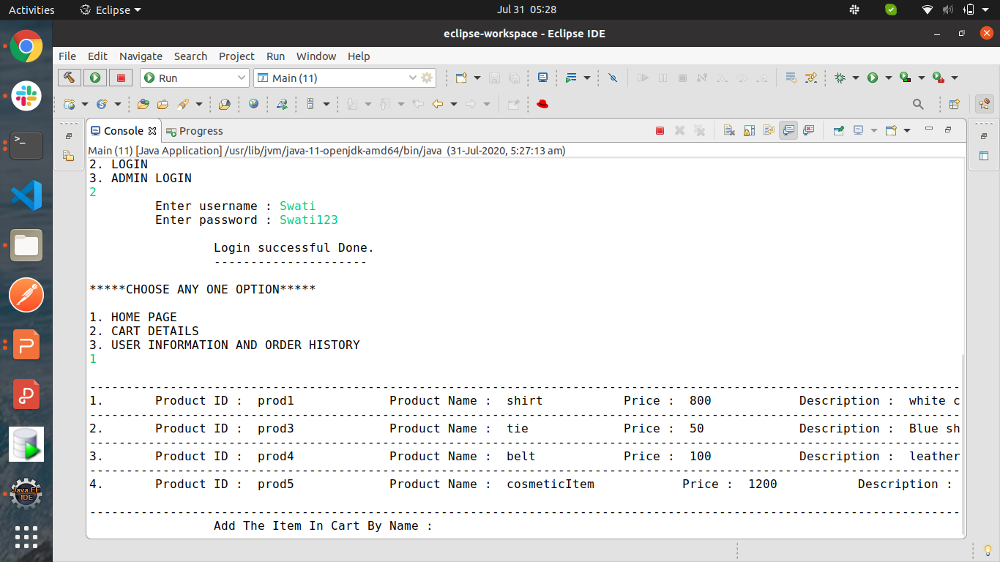
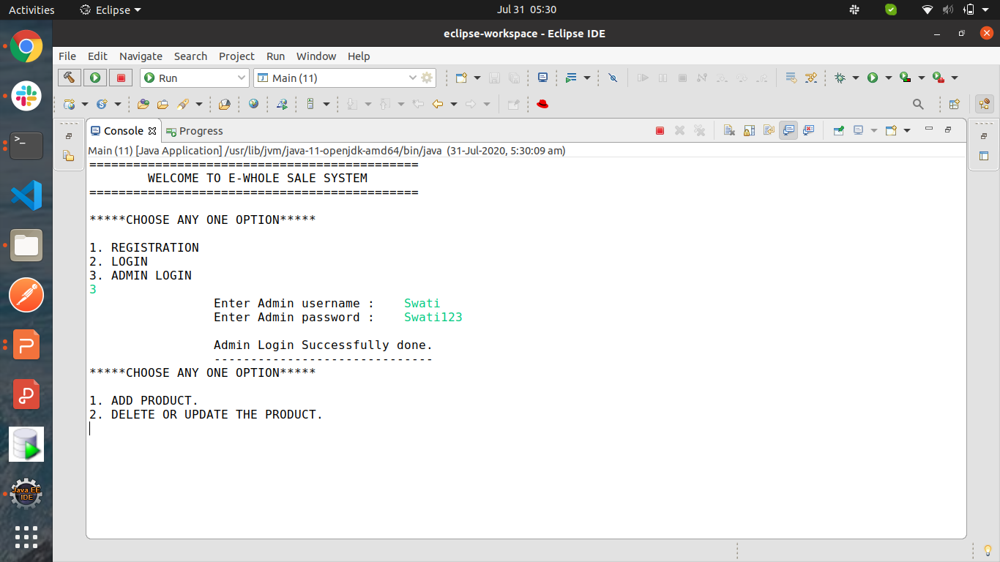
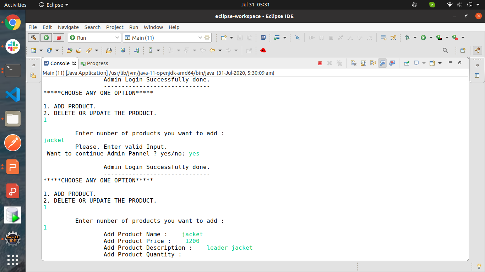
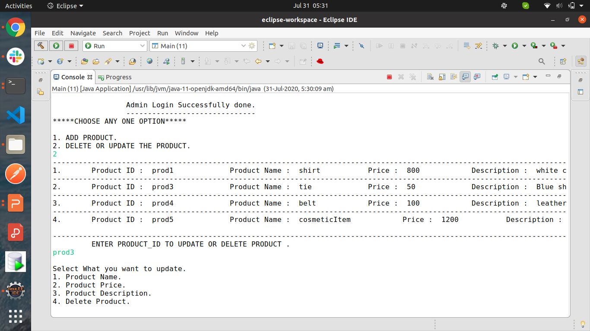
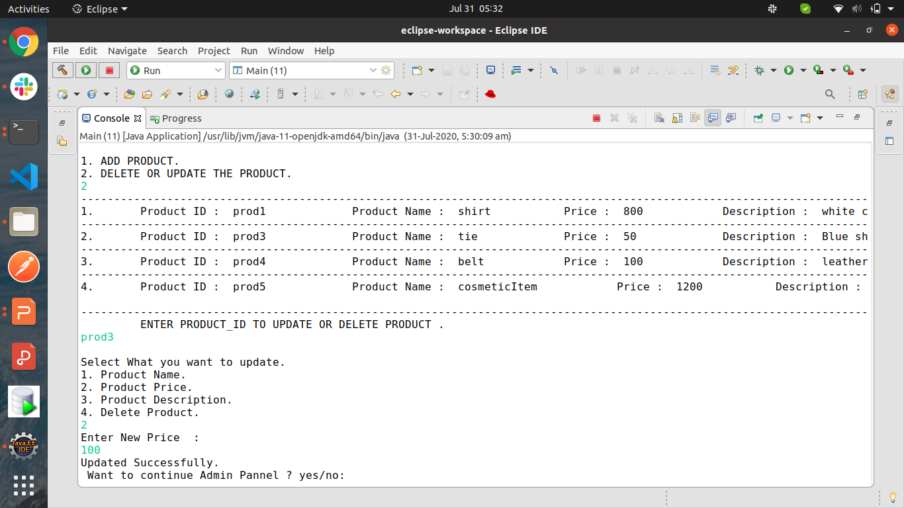
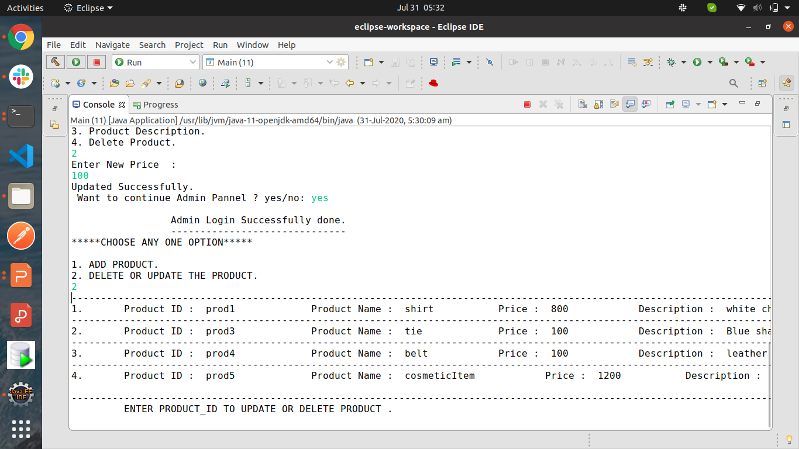

# E- WholeSale System 

* Project completed in a week 2020.
* E- WholeSale System is a console based project, build for customer who wants to buy the products in a large scale. In this project their are there important role exist:
  * Admin: He is having the right to add, delete and modify the item details.
  * Customers: They can edit thier shopping-list, and also able to perform the CRUD operations.
  * Users: * First they need to create their account.
           * Responsible for Login and registration.
* Invoive generated in a form of PDF.
           
# Needs? 

* It helps to work in a smart and a easy way.
* User save thier time to shop the products.
* NO need to go for anywhere to buy the product.

# Implementation 

* SQL Query: For storing the details of the users, products, shipment, stock etc.
* Java OOPs concept.
* CRUD operation functionalities.

# Screenshot

  
  
  
  
 

